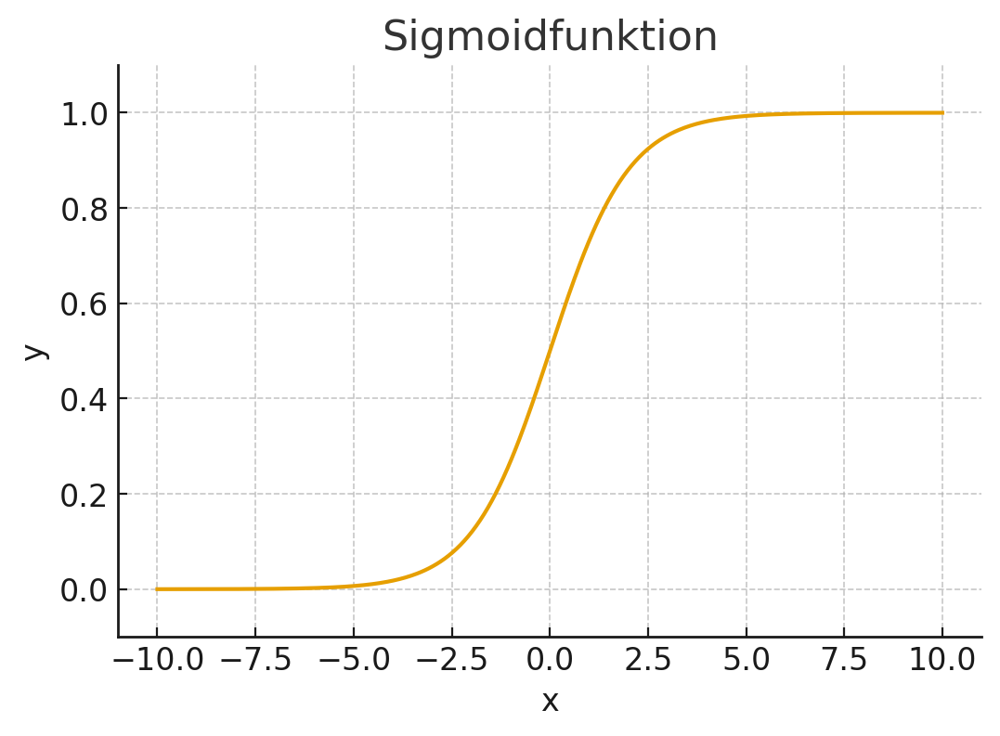
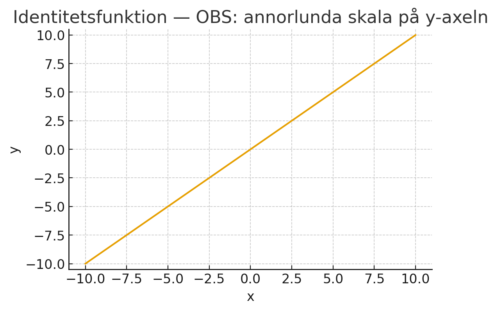

## Vad ska du lära dig?

I den här lektionen dyker vi ner i den absolut minsta, men viktigaste, komponenten i nästan all modern AI: den **artificiella neuronen**. Det är den grundläggande byggstenen i de neuronnät som driver allt från självkörande bilar till språkmodeller som ChatGPT.

**Efter lektionen kommer du att förstå:**

- Hur en neuron fungerar som en enkel informationsprocessor
- Vad **indata** och **vikter** är för något
- Hur en neuron "tänker" genom att räkna ut en **linjär kombination**
- Vad en **aktiveringsfunktion** är och varför den är så viktig

---

## En enkel start: Som ett kvitto i en affär

En enskild neuron är egentligen inte så komplicerad. Tänk dig att du handlar i en affär. Ditt kvitto räknas ut genom att man tar **antalet** av varje vara och multiplicerar med dess **pris**. Till sist summerar man allt för att få en totalsumma.

**Analogin:**

- **Antal varor** → Neuronens **indata** (informationen den får in)
- **Pris per vara** → Neuronens **vikter** (hur viktig varje indata är)
- **Totalsumman** → Resultatet av neuronens första beräkning

En neuron gör precis detta: den tar emot flera olika indata, multiplicerar varje indata med en vikt, och summerar allt.

## Indata, vikter och linjär kombination

Låt oss säga att en neuron har 3 indata: $x_1$, $x_2$ och $x_3$.

För att kunna värdera dessa behöver den 3 motsvarande vikter: $w_1$, $w_2$ och $w_3$.

Neuronens första steg är att räkna ut en "totalpoäng", vilket med ett finare ord kallas för en **linjär kombination**. Beräkningen ser ut så här:

$$
\text{Totalpoäng} = (x_1 \times w_1) + (x_2 \times w_2) + (x_3 \times w_3)
$$

> [!NOTE] Exempel: Katt eller hund?
> Låt oss säga att en neuron ska bedöma om en bild föreställer en katt. Den har tre indata:
> 
> **Indata:**
> - $x_1$ (har spetsiga öron?): **1** (ja)
> - $x_2$ (har morrhår?): **1** (ja)
> - $x_3$ (säger "vov"?): **0** (nej)
> 
> **Vikter (som neuronen har lärt sig):**
> - $w_1$ (öron): **+4**
> - $w_2$ (morrhår): **+4**
> - $w_3$ (skäller): **-10**
> 
> **Beräkning:**
> 
> $$
> \text{Totalpoäng} = (1 \times 4) + (1 \times 4) + (0 \times -10) = 4 + 4 + 0 = 8
> $$
> 
> Totalpoängen är **8**, vilket är en stark signal för "katt"!

> [!TIP] Vikter är nyckeln till inlärning
> Vikterna är det som AI:n lär sig under träning. Genom att justera vikterna kan neuronen bli bättre på att ge rätt svar:
> 
> - **Hög positiv vikt** → "Detta är ett starkt bevis FÖR"
> - **Hög negativ vikt** → "Detta är ett starkt bevis EMOT"
> - **Vikt nära noll** → "Detta spelar ingen roll"

## Aktiveringsfunktionen: Neuronens beslut

När neuronens totalpoäng är uträknad, måste den bestämma sig för vad den ska göra med den. Ska den skicka en signal vidare? Och i så fall, hur stark ska signalen vara?

Detta beslut fattas av **aktiveringsfunktionen**. Det är en matematisk funktion som tar totalpoängen som indata och producerar neuronens slutgiltiga utdata.

### Vanliga aktiveringsfunktioner

**1. Stegfunktion (Step function)**

Den enklaste varianten. Om totalpoängen är över ett visst tröskelvärde (t.ex. 0), skickar den ut en 1:a (PÅ). Annars skickar den ut en 0:a (AV). Den fungerar som en digital strömbrytare.

**2. Sigmoidfunktion (Sigmoid function)**

En mjukare version. Istället för bara PÅ/AV, ger den ett värde *mellan* 0 och 1. En hög totalpoäng ger ett värde nära 1, en låg poäng ger ett värde nära 0. Detta är användbart för att visa sannolikheter eller "hur säker" neuronen är.

**3. ReLU (Rectified Linear Unit)**

En av de mest populära i moderna neuronnät. Om totalpoängen är negativ blir utdata 0. Om den är positiv skickas den vidare som den är. Enkel men effektiv!

> [!NOTE] ReLU saknar bild
> En bild för ReLU-funktionen behöver läggas till.

**4. Identitetsfunktion (Linear function)**

Den gör ingenting alls, utan skickar bara vidare totalpoängen precis som den är. Används oftast i den sista delen av nätverk som ska förutspå ett numeriskt värde, som ett huspris eller en temperatur.

## Från en neuron till ett nätverk

En enskild neuron är bra på att fatta enkla, linjära beslut. Men verkligheten är sällan så enkel. Hur känner en AI igen din mormor på ett foto?

En neuron kan kanske lära sig att känna igen en vertikal linje i en bild. En annan kan lära sig känna igen en horisontell linje. En tredje en böjd linje. Var för sig är de ganska begränsade.

Men om vi kopplar ihop dem i ett **neuronnät** kan magi uppstå:

**1. Första lagret (enkla mönster)**

Neuroner som känner igen grundläggande saker: kanter, hörn, färgfläckar.

**2. Andra lagret (kombinationer)**

Tar emot information från första lagret. En neuron här kanske aktiveras om den får signaler från en "vertikal linje"-neuron och en "horisontell linje"-neuron, och lär sig på så sätt att känna igen ett kors eller en näsa.

**3. Tredje lagret (komplexa strukturer)**

Tar emot information om näsor, ögon och munnar från andra lagret och lär sig att känna igen ett helt ansikte.

> [!INFO] Hierarkisk inlärning
> Genom att koppla ihop neuroner i lager kan ett neuronnät lära sig otroligt komplexa mönster och hierarkier. Det är denna struktur som gör djupinlärning så kraftfullt. Den enskilda neuronen är bara en liten, men fundamental, del av ett mycket större system.

---

## Sammanfattning

> [!TIP] Sammanfattning: Så fungerar en neuron
> 1. En neuron tar emot **indata** ($x_1, x_2, x_3, ...$)
> 2. Den multiplicerar varje indata med en **vikt** ($w_1, w_2, w_3, ...$) för att avgöra dess betydelse
> 3. Alla produkter summeras till en **linjär kombination** (en totalpoäng)
> 4. En **aktiveringsfunktion** bestämmer neuronens slutgiltiga **utdata** baserat på totalpoängen
> 5. Genom att koppla ihop många neuroner i **lager** skapas ett **neuronnät** som kan lösa komplexa problem

---

**Nästa steg:** I nästa lektion ska vi se hur man kan koppla ihop många sådana här neuroner för att skapa ett **neuronnät** som kan lösa mycket mer komplexa problem än vad en enskild neuron klarar av.

