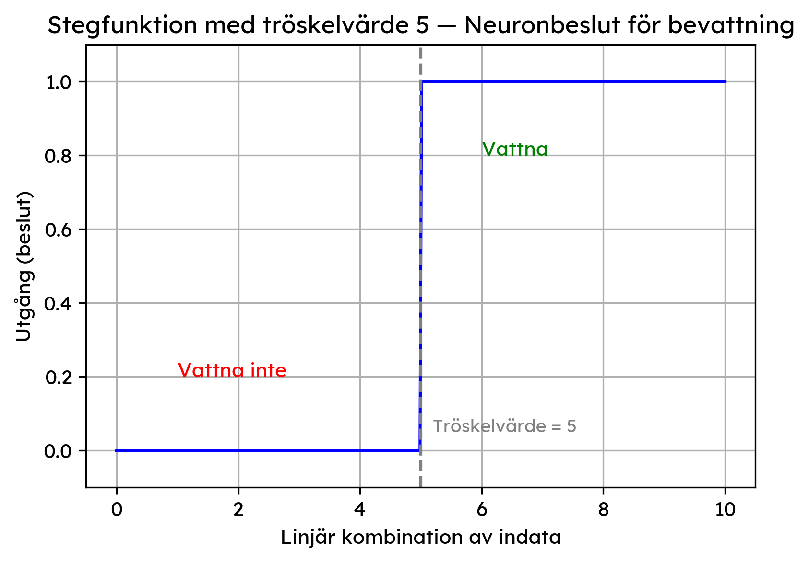

import MultipleChoiceQuiz from '../../../components/MultipleChoiceQuiz.astro';
import FillInQuiz from '../../../components/FillInQuiz.astro';
import Glossary from '../../../components/Glossary.astro';

## Uppgift: Din första tänkande maskin

I den här uppgiften ska du agera som en artificiell neuron. Målet är att du ska få en praktisk känsla för hur en neuron väger samman information för att fatta ett beslut. 

> [!INFO] Påminnelse från föregående lektion
> Vi kommer att använda de koncept du lärde dig i [Lektion 1: Vad är en neuron?](./1-vad-ar-en-neuron):
> - **Indata** ($x_1, x_2, x_3, ...$) - informationen neuronen får in
> - **Vikter** ($w_1, w_2, w_3, ...$) - hur viktig varje indata är
> - **Linjär kombination** - totalpoängen: $(x_1 \times w_1) + (x_2 \times w_2) + ...$
> - **Aktiveringsfunktion** - bestämmer slutgiltiga utdata baserat på totalpoängen

---

## Del 1: Ska växten vattnas? 🌱

Föreställ dig en liten robot som ska ta hand om en krukväxt. Roboten har en enda neuron som ska bestämma om den ska vattna växten eller inte. Neuronen har tillgång till tre informationskällor (indata).

**Indata:**
- $x_1$ = `Jordens fuktighet` (0 = torr, 1 = fuktig)
- $x_2$ = `Antal soltimmar idag` (ett tal, t.ex. 8)
- $x_3$ = `Regnade det igår?` (0 = nej, 1 = ja)

### Fråga 1: Resonera kring vikterna

Innan vi räknar, fundera på vikterna. Kom ihåg från föregående lektion:

> [!TIP] Vikter bestämmer betydelse
> - **Hög positiv vikt** → "Detta är ett starkt bevis FÖR"
> - **Hög negativ vikt** → "Detta är ett starkt bevis EMOT"
> - **Vikt nära noll** → "Detta spelar ingen roll"

**Resonera:**
- Vilken typ av vikt (positiv eller negativ) borde `Jordens fuktighet` ha? Varför?
- Vilken typ av vikt borde `Antal soltimmar idag` ha? Varför?
- Vilken typ av vikt borde `Regnade det igår?` ha? Varför?

### Fråga 2: Matematisk beräkning

Låt oss ge neuronen följande inlärda vikter:
- $w_1$ (fuktighet): **-5**
- $w_2$ (soltimmar): **+2**
- $w_3$ (regn igår): **-3**

**Uppgift A: Solig och torr dag**

En mycket solig dag (10 soltimmar) har det inte regnat igår och jorden är helt torr.

- $x_1 = 0$ (torr jord)
- $x_2 = 10$ (soltimmar)
- $x_3 = 0$ (inget regn igår)

Ställ upp och beräkna den linjära kombinationen:

$$
\text{Totalpoäng} = (x_1 \times w_1) + (x_2 \times w_2) + (x_3 \times w_3)
$$

<FillInQuiz 
  quizId="uppgift-a-total"
  question="Vad blir totalpoängen för Uppgift A?"
  correctAnswer={["20", "20.0"]}
  type="number"
  explanation="Beräkning: (0 × -5) + (10 × 2) + (0 × -3) = 0 + 20 + 0 = 20"
/>

**Uppgift B: Molnig och fuktig dag**

Det är en molnig dag (2 soltimmar), men det regnade igår och jorden är fortfarande fuktig.

- $x_1 = 1$ (fuktig jord)
- $x_2 = 2$ (soltimmar)
- $x_3 = 1$ (regn igår)

Ställ upp och beräkna den linjära kombinationen:

$$
\text{Totalpoäng} = (x_1 \times w_1) + (x_2 \times w_2) + (x_3 \times w_3)
$$

<FillInQuiz 
  quizId="uppgift-b-total"
  question="Vad blir totalpoängen för Uppgift B?"
  correctAnswer={["-4", "-4.0"]}
  type="number"
  explanation="Beräkning: (1 × -5) + (2 × 2) + (1 × -3) = -5 + 4 - 3 = -4"
/>

### Fråga 3: Fatta ett beslut med aktiveringsfunktion

Neuronens aktiveringsfunktion är en enkel **stegfunktion** (precis som i [Lektion 1](./1-vad-ar-en-neuron#vanliga-aktiveringsfunktioner)) med tröskelvärdet 5:

```
Om Totalpoäng > 5  → Utdata = 1 (Vattna!)
Om Totalpoäng ≤ 5  → Utdata = 0 (Vattna inte)
```


**Din uppgift:**

Baserat på dina uträkningar i Fråga 2, vilket beslut fattar neuronen i:

<MultipleChoiceQuiz 
  quizId="uppgift-a-beslut"
  question="Uppgift A (solig och torr, totalpoäng = 20): Vad blir utdata?"
  options={[
    "Utdata = 0 (Vattna inte)",
    "Utdata = 1 (Vattna!)"
  ]}
  correctAnswer={1}
  explanation="Eftersom totalpoängen (20) är större än tröskelvärdet (5), blir utdata 1. Neuronen bestämmer sig för att vattna, vilket är vettigt eftersom jorden är torr och det varit mycket sol!"
/>

<MultipleChoiceQuiz 
  quizId="uppgift-b-beslut"
  question="Uppgift B (molnig och fuktig, totalpoäng = -4): Vad blir utdata?"
  options={[
    "Utdata = 0 (Vattna inte)",
    "Utdata = 1 (Vattna!)"
  ]}
  correctAnswer={0}
  explanation="Eftersom totalpoängen (-4) är mindre än eller lika med tröskelvärdet (5), blir utdata 0. Neuronen bestämmer sig för att INTE vattna, vilket är vettigt eftersom jorden redan är fuktig!"
/>

## Del 2: Känna igen ett mönster 🔲

Nu ska vi använda en neuron för att känna igen ett enkelt visuellt mönster. En neuron ska analysera en 2×2-bild och avgöra om den innehåller ett specifikt mönster. Varje pixel är en indata, där **1** är svart (■) och **0** är vit (□).

Neuronen är tränad att känna igen ett **diagonalt mönster från övre vänstra till nedre högra hörnet**. Den har lärt sig följande vikter:

**Pixelpositioner och vikter:**

```
┌─────────┬─────────┐
│ x₁ (w₁) │ x₂ (w₂) │
│  +5     │  -5     │
├─────────┼─────────┤
│ x₃ (w₃) │ x₄ (w₄) │
│  -5     │  +5     │
└─────────┴─────────┘
```

> [!NOTE] Varför dessa vikter?
> Neuronen "belönar" svarta pixlar i diagonalen (övre vänster + nedre höger) med positiva vikter (+5).
> Den "straffar" svarta pixlar utanför diagonalen (övre höger + nedre vänster) med negativa vikter (-5).

### Fråga 4: Beräkna poäng för olika mönster

Din uppgift är att beräkna totalpoängen (linjär kombination) för de tre bilderna nedan. Visa din uträkning för varje bild.

**Bild A: Korrekt diagonal**

```
┌───┬───┐
│ ■ │ □ │  Indata: x₁=1, x₂=0, x₃=0, x₄=1
├───┼───┤
│ □ │ ■ │  Vikter: w₁=+5, w₂=-5, w₃=-5, w₄=+5
└───┴───┘
```

Beräkna: $\text{Totalpoäng} = (1 \times 5) + (0 \times -5) + (0 \times -5) + (1 \times 5) = \text{10}$

**Bild B: Fel diagonal**

```
┌───┬───┐
│ □ │ ■ │  Indata: x₁=0, x₂=1, x₃=1, x₄=0
├───┼───┤
│ ■ │ □ │  Vikter: w₁=+5, w₂=-5, w₃=-5, w₄=+5
└───┴───┘
```

Beräkna: $\text{Totalpoäng} = (0 \times 5) + (1 \times -5) + (1 \times -5) + (0 \times 5) = ?$

<FillInQuiz 
  quizId="bild-b-poang"
  question="Vad blir totalpoängen för Bild B (fel diagonal)?"
  correctAnswers={["-10", "−10", "minus 10"]}
  type="text"
  explanation="Rätt! (0 × 5) + (1 × -5) + (1 × -5) + (0 × 5) = 0 - 5 - 5 + 0 = -10. Neuronen straffar detta mönster hårt eftersom pixlarna är på fel diagonal!"
/>

**Bild C: Helt svart**

```
┌───┬───┐
│ ■ │ ■ │  Indata: x₁=1, x₂=1, x₃=1, x₄=1
├───┼───┤
│ ■ │ ■ │  Vikter: w₁=+5, w₂=-5, w₃=-5, w₄=+5
└───┴───┘
```

Beräkna: $\text{Totalpoäng} = (1 \times 5) + (1 \times -5) + (1 \times -5) + (1 \times 5) = ?$

<FillInQuiz 
  quizId="bild-c-poang"
  question="Vad blir totalpoängen för Bild C (helt svart)?"
  correctAnswers={["0", "noll"]}
  type="text"
  explanation="Rätt! (1 × 5) + (1 × -5) + (1 × -5) + (1 × 5) = 5 - 5 - 5 + 5 = 0. De positiva och negativa vikterna tar ut varandra!"
/>

### Fråga 5: Analysera resultatet

<FillInQuiz 
  quizId="analys-hogst"
  question="Vilken bild fick högst poäng? Varför var det väntat, med tanke på neuronens vikter?"
  freeResponse={true}
  explanation="Bild A fick högst poäng (10). Detta var väntat eftersom neuronen är tränad att känna igen diagonalen från övre vänster till nedre höger. Bild A har exakt detta mönster, och de positiva vikterna (+5) belönar de svarta pixlarna i diagonalen."
  hint="Tänk på vilka pixlar som har positiva vikter."
/>

<FillInQuiz 
  quizId="analys-lagst"
  question="Vilken bild fick lägst poäng? Förklara varför neuronens vikter 'straffade' just det mönstret så hårt."
  freeResponse={true}
  explanation="Bild B fick lägst poäng (-10). Neuronen straffade detta mönster hårt eftersom det har fel diagonal (övre höger till nedre vänster). De svarta pixlarna hamnar på positioner med negativa vikter (-5), vilket ger en mycket låg totalpoäng."
  hint="Vilken bild har svarta pixlar på positioner med negativa vikter?"
/>

<FillInQuiz 
  quizId="vit-bild-poang"
  question="Vad blir totalpoängen för en helt vit bild (x₁=0, x₂=0, x₃=0, x₄=0)?"
  correctAnswers={["0", "noll"]}
  type="text"
  explanation="Rätt! En helt vit bild ger totalpoäng 0, eftersom alla indata är 0. Detta visar neuronens 'grundinställning' - utan någon information fattar den inget beslut åt något håll."
/>

<MultipleChoiceQuiz 
  quizId="stegfunktion-diagonal"
  question="Om du använder en stegfunktion med tröskelvärde 5, vilka bilder skulle ge utdata 1 ('Detta är en diagonal!')?"
  options={[
    "Endast Bild A",
    "Bild A och Bild C",
    "Alla tre bilderna",
    "Ingen av bilderna"
  ]}
  correctAnswer={0}
  explanation="Endast Bild A (poäng = 10) är större än tröskelvärdet 5, så bara den ger utdata 1. Bild B har -10 och Bild C har 0, båda ≤ 5, så de ger utdata 0."
/>

---

> [!TIP] Grattis!
> Genom att slutföra denna uppgift har du nu en djupare förståelse för hur även en enda, enkel neuron kan lära sig att känna igen mönster och fatta beslut baserat på indata och vikter.

<Glossary 
  terms={[
    "Indata (pixlar)",
    "Vikter",
    "Linjär kombination",
    "Aktiveringsfunktion",
    "Stegfunktion",
    "Tröskelvärde",
    "Mönsterigenkänning"
  ]}
/>
