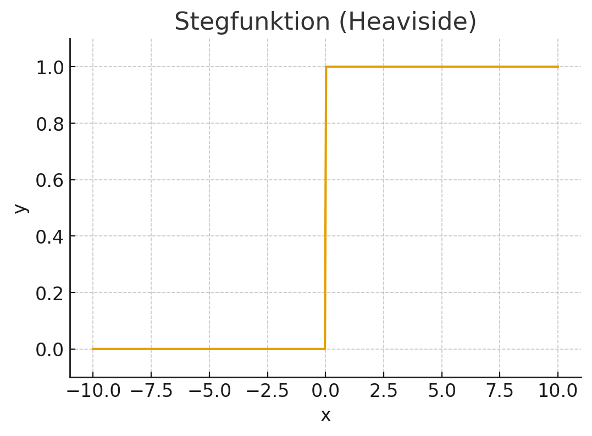

## Uppgift: Din första tänkande maskin

I den här uppgiften ska du agera som en artificiell neuron. Målet är att du ska få en praktisk känsla för hur en neuron väger samman information för att fatta ett beslut. 

> [!INFO] Påminnelse från föregående lektion
> Vi kommer att använda de koncept du lärde dig i [Lektion 1: Vad är en neuron?](./1-vad-ar-en-neuron):
> - **Indata** ($x_1, x_2, x_3, ...$) - informationen neuronen får in
> - **Vikter** ($w_1, w_2, w_3, ...$) - hur viktig varje indata är
> - **Linjär kombination** - totalpoängen: $(x_1 \times w_1) + (x_2 \times w_2) + ...$
> - **Aktiveringsfunktion** - bestämmer slutgiltiga utdata baserat på totalpoängen

---

## Del 1: Ska växten vattnas? 🌱

Föreställ dig en liten robot som ska ta hand om en krukväxt. Roboten har en enda neuron som ska bestämma om den ska vattna växten eller inte. Neuronen har tillgång till tre informationskällor (indata).

**Indata:**
- $x_1$ = `Jordens fuktighet` (0 = torr, 1 = fuktig)
- $x_2$ = `Antal soltimmar idag` (ett tal, t.ex. 8)
- $x_3$ = `Regnade det igår?` (0 = nej, 1 = ja)

### Fråga 1: Resonera kring vikterna

Innan vi räknar, fundera på vikterna. Kom ihåg från föregående lektion:

> [!TIP] Vikter bestämmer betydelse
> - **Hög positiv vikt** → "Detta är ett starkt bevis FÖR"
> - **Hög negativ vikt** → "Detta är ett starkt bevis EMOT"
> - **Vikt nära noll** → "Detta spelar ingen roll"

**Resonera:**
- Vilken typ av vikt (positiv eller negativ) borde `Jordens fuktighet` ha? Varför?
- Vilken typ av vikt borde `Antal soltimmar idag` ha? Varför?
- Vilken typ av vikt borde `Regnade det igår?` ha? Varför?

### Fråga 2: Matematisk beräkning

Låt oss ge neuronen följande inlärda vikter:
- $w_1$ (fuktighet): **-5**
- $w_2$ (soltimmar): **+2**
- $w_3$ (regn igår): **-3**

**Uppgift A: Solig och torr dag**

En mycket solig dag (10 soltimmar) har det inte regnat igår och jorden är helt torr.

- $x_1 = 0$ (torr jord)
- $x_2 = 10$ (soltimmar)
- $x_3 = 0$ (inget regn igår)

Ställ upp och beräkna den linjära kombinationen:

$$
\text{Totalpoäng} = (x_1 \times w_1) + (x_2 \times w_2) + (x_3 \times w_3) = \text{?}
$$

**Uppgift B: Molnig och fuktig dag**

Det är en molnig dag (2 soltimmar), men det regnade igår och jorden är fortfarande fuktig.

- $x_1 = 1$ (fuktig jord)
- $x_2 = 2$ (soltimmar)
- $x_3 = 1$ (regn igår)

Ställ upp och beräkna den linjära kombinationen:

$$
\text{Totalpoäng} = (x_1 \times w_1) + (x_2 \times w_2) + (x_3 \times w_3) = \text{?}
$$

### Fråga 3: Fatta ett beslut med aktiveringsfunktion

Neuronens aktiveringsfunktion är en enkel **stegfunktion** (precis som i [Lektion 1](./1-vad-ar-en-neuron#vanliga-aktiveringsfunktioner)) med tröskelvärdet 5:

```
Om Totalpoäng > 5  → Utdata = 1 (Vattna!)
Om Totalpoäng ≤ 5  → Utdata = 0 (Vattna inte)
```



**Din uppgift:**

Baserat på dina uträkningar i Fråga 2, vilket beslut fattar neuronen i:
- **Uppgift A** (solig och torr)?
- **Uppgift B** (molnig och fuktig)?

Är besluten vettiga? Varför/varför inte?

---

## Del 2: Känna igen ett mönster 🔲

Nu ska vi använda en neuron för att känna igen ett enkelt visuellt mönster. En neuron ska analysera en 2×2-bild och avgöra om den innehåller ett specifikt mönster. Varje pixel är en indata, där **1** är svart (■) och **0** är vit (□).

Neuronen är tränad att känna igen ett **diagonalt mönster från övre vänstra till nedre högra hörnet**. Den har lärt sig följande vikter:

**Pixelpositioner och vikter:**

```
┌─────────┬─────────┐
│ x₁ (w₁) │ x₂ (w₂) │
│  +5     │  -5     │
├─────────┼─────────┤
│ x₃ (w₃) │ x₄ (w₄) │
│  -5     │  +5     │
└─────────┴─────────┘
```

> [!NOTE] Varför dessa vikter?
> Neuronen "belönar" svarta pixlar i diagonalen (övre vänster + nedre höger) med positiva vikter (+5).
> Den "straffar" svarta pixlar utanför diagonalen (övre höger + nedre vänster) med negativa vikter (-5).

### Fråga 4: Beräkna poäng för olika mönster

Din uppgift är att beräkna totalpoängen (linjär kombination) för de tre bilderna nedan. Visa din uträkning för varje bild.

**Bild A: Korrekt diagonal**

```
┌───┬───┐
│ ■ │ □ │  Indata: x₁=1, x₂=0, x₃=0, x₄=1
├───┼───┤
│ □ │ ■ │  Vikter: w₁=+5, w₂=-5, w₃=-5, w₄=+5
└───┴───┘
```

Beräkna: $\text{Totalpoäng} = (1 \times 5) + (0 \times -5) + (0 \times -5) + (1 \times 5) = \text{?}$

**Bild B: Fel diagonal**

```
┌───┬───┐
│ □ │ ■ │  Indata: x₁=0, x₂=1, x₃=1, x₄=0
├───┼───┤
│ ■ │ □ │  Vikter: w₁=+5, w₂=-5, w₃=-5, w₄=+5
└───┴───┘
```

Beräkna: $\text{Totalpoäng} = (0 \times 5) + (1 \times -5) + (1 \times -5) + (0 \times 5) = \text{?}$

**Bild C: Helt svart**

```
┌───┬───┐
│ ■ │ ■ │  Indata: x₁=1, x₂=1, x₃=1, x₄=1
├───┼───┤
│ ■ │ ■ │  Vikter: w₁=+5, w₂=-5, w₃=-5, w₄=+5
└───┴───┘
```

Beräkna: $\text{Totalpoäng} = (1 \times 5) + (1 \times -5) + (1 \times -5) + (1 \times 5) = \text{?}$

### Fråga 5: Analysera resultatet

**Reflektera över dina beräkningar:**

1. Vilken bild fick **högst** poäng? Varför var det väntat, med tanke på neuronens vikter?

2. Vilken bild fick **lägst** poäng? Förklara varför neuronens vikter "straffade" just det mönstret så hårt.

3. Vad blir totalpoängen för en **helt vit bild** ($x_1=0, x_2=0, x_3=0, x_4=0$)? Vad säger det om neuronens grundinställning?

4. Om du skulle använda en **stegfunktion** med tröskelvärde 5 som aktiveringsfunktion, vilka bilder skulle ge utdata 1 ("Detta är en diagonal!")?

---

> [!TIP] Grattis!
> Genom att slutföra denna uppgift har du nu en djupare förståelse för hur även en enda, enkel neuron kan lära sig att känna igen mönster och fatta beslut baserat på indata och vikter.
> 
> **Nästa steg:** I nästa lektion ska vi se hur man kopplar ihop många sådana neuroner till ett neuronnät som kan lösa mycket mer komplexa problem!
