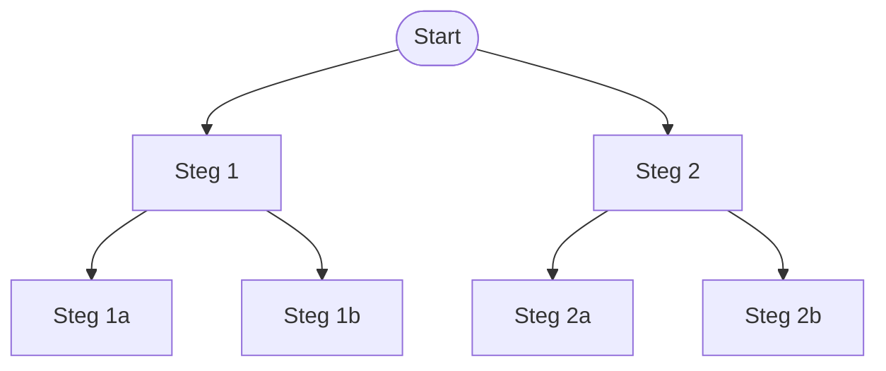

import MultipleChoiceQuiz from '../../../components/MultipleChoiceQuiz.astro';
import FillInQuiz from '../../../components/FillInQuiz.astro';
import Glossary from '../../../components/Glossary.astro';

## Från modell till strategi

Alla AI-problem kräver inte maskininlärning. Sökalgoritmer låter oss utforska möjliga tillstånd steg för steg tills vi hittar en lösning. I den här lektionen jämför vi **bredden-först-sökning (BFS)**, **djupet-först-sökning (DFS)** och heuristiska varianter som **A* (A-stjärna)**.

> [!INFO] När är sök bättre?
> - Problemet kan beskrivas som tillstånd och handlingar (spel, pussel, rutter).
> - Det finns tydligt mål och vi kan utvärdera hur nära målet vi är.
> - Vi behöver lösning nu, inte en modell för framtida data.

## Så arbetar BFS och DFS

- **BFS** utforskar nivå för nivå (radvis). Alla steg som ligger lika långt bort besöks innan vi går vidare. Resultat: hittar kortaste väg när varje steg kostar lika mycket men kräver mer minne.
- **DFS** följer en gren tills den tar slut. Resultat: kräver lite minne men riskerar att fastna långt bort innan den hittar målet.

Tänk på BFS som att läsa sida för sida i en bok, medan DFS är att följa en berättelsegren hela vägen till slutet innan du går tillbaka och testar nästa.

<MultipleChoiceQuiz
  quizId="bfs-vs-dfs"
  question="Vilken egenskap har BFS men inte DFS om alla bågar har samma kostnad?"
  options={[
    'BFS hittar alltid kortaste vägen till målet',
    'BFS kräver mindre minne än DFS',
    'BFS fastnar lätt i loopar',
    'BFS fungerar bara för labyrinter'
  ]}
  correctAnswer={0}
  explanation="BFS utforskar alla noder på ett djup innan det går vidare, vilket garanterar kortaste väg när alla steg kostar lika mycket."
/>

## Heuristik och A*

- **Heuristik** är en snabb tumregel som uppskattar hur långt det är kvar till målet. Exempel: i en stad kan fågelvägen ge en grov uppskattning av gångavståndet.
- A* kombinerar faktiska kostnader (hur långt vi gått hittills) med heuristiken (hur långt vi tror det är kvar). Summan styr vilken nod som utforskas först.
- Om heuristiken aldrig överskattar (är **admissibel**) garanterar A* fortfarande den kortaste vägen, men använder mindre tid än BFS.

<FillInQuiz
  quizId="heuristik-effekt"
  question="Ge ett exempel på en enkel heuristik för att hitta rätt rum i en skola och förklara varför den kan vara hjälpsam."
  freeResponse={true}
  explanation="Heuristiken ska guida sökningen mot målet utan att lura algoritmen bort från en kort väg. Beskriv din tumregel och hur den hjälper."
/>

## Jämförelse mot ML

Reflektera i loggen:
- Vilka problem löser sökalgoritmer bättre än ML?
- När är ML överlägset?
- Hur skulle du kombinera sök och ML (t.ex. spel-AI med heuristisk beräkning)?

> [!NOTE] Exempel
> Ett spel som schack använder ofta sökträd (för att utforska drag) men kompletterar med ML för att bedöma ställningar snabbare.

<Glossary
  terms={[
    'Tillståndsrum',
    'BFS',
    'DFS',
    'A*',
    'Heuristik'
  ]}
/>
