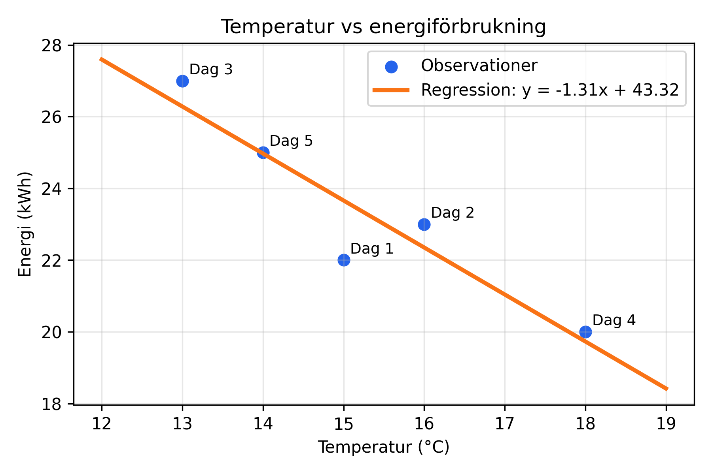
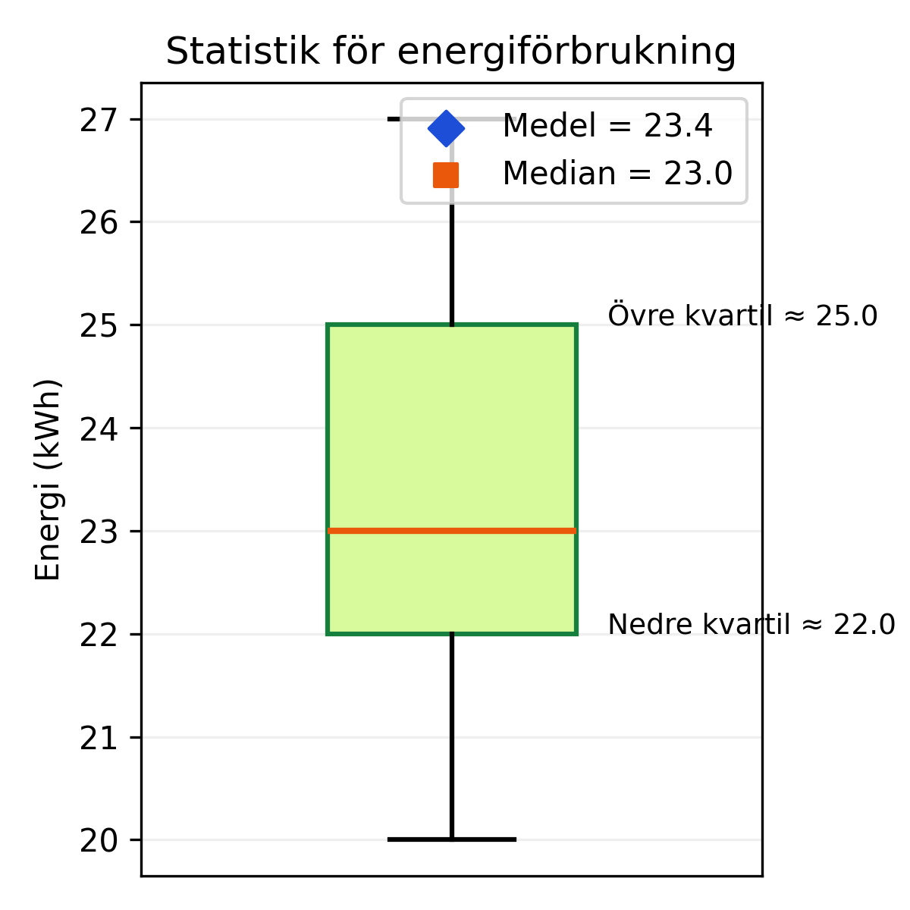

## Vad går projektet ut på?

Resterande av lektioner fram till jullovet komm ni att jobba med att **välja och motivera rätt verktyg** för olika problem. Fokus ligger på resonemang och strategi – inte på att koda eller träna stora modeller. Dina verktyg kan vara allt från huvudräkning och miniräknare till regression, beslutsträd, neuronnät och sökalgoritmer (eller ytterligare verktyg som vi inte ens nämnt i kursen).

> [!INFO] Viktigt
> - Använd enkla verktyg du redan känner till. Du behöver inte kunna programmera.
> - Alla svar skrivs antingen i ett Google Dokument eller för hand.
> - Ni ska alltid motivera **varför** ett verktyg passar och vilka begränsningar ni ser.

>[!WARNING] Viktigt 2
> - Ni kan jobba **enskilt eller parvis**.
> - Om ni använder **LLM:er (ex. ChatGPT)** i projektet måste ni skriva ett kort resonemang om **vad ni använde det till och varför**. I linje med kursen är det givetvis tillåtet, men det är viktigt att skilja på vad som är era resonemang och var ni använt artificiell intelligens.
> - Glöm heller inte att **be om hjälp och/eller feedback** under arbetets gång!

---

## Uppgift A: Matteval i vardagen

Resonera kort i löpande text. Beskriv: valet av verktyg, varför det är rimligt i situationen och minst en fördel/nackdel.

> [!TIP] Exempel – gör inte denna
> #### Exempel
> 1. **Kiosken**: Du ska köpa två mackor (35 kr/st) och tre drycker (18 kr/st). Kassörskan slog fel pris.
>
> > "Vi använder miniräknare eftersom flera multiplikationer + additioner ökar slarvrisken i huvudet. Fördel: snabbt och exakt. Nackdel: kräver fungerande mobil/batteri."

1. **Kakförsäljning**: Klassen säljer kakor. Du ansvarar för beställningslistan där varje elev kan beställa flera sorter samma dag. Hur organiserar du försäljningen så att du ser totalsummor och vilka som betalat?
2. **Matematikproblemet**: Du ska lösa ekvationen $y = 0,3x^2 - 4x + 5$ och behöver veta var funktionen byter tecken mellan $x = -2$ och $x = 6$. Hur löser du problemet?
3. **Tacofredag**: Du har 200 kr på kontot och lovat familjen att handla tacos. Hur håller du reda på budgeten under butiksbesöket?

---

## Uppgift B: Analysera information

Vi har nu en tabll med följande information: dag, temperatur och energianvändning (kWh). Ni ska nu ta beslut om vilka verktyg vi ska använda för att analysera informationen.

### 1. Datasetet

| Dag | Temp (°C) | Energi (kWh) |
| --- | --- | --- |
| 1 | 15 | 22 |
| 2 | 16 | 23 |
| 3 | 13 | 27 |
| 4 | 18 | 20 |
| 5 | 14 | 25 |

Besvara följande:

- Vilka frågor kan vi besvara med informationen från tabellen? Vad kan vi använda den till?
- Hade informationen kunnat presenteras på ett annat sätt? Hur? Vad finns det för- och nackdelar med olika sätt att presentera information?

### 2. Tolka två färdiga analyser (nivå 2)

Den här delen handlar om att **tolka** två redan framtagna analyser av samma dataset (temperatur vs. energianvändning). Ni behöver inte skapa graferna själva – de ligger nedan.

**Linjär regression**

_Diagrammet visar punkterna och en linjär regressionslinje._

Besvara följande frågor utifrån diagrammet

1. Vilka mönster ser du? Kommentera lutningen och om linjen verkar passa punkterna.
2. Vilka antaganden gör man om sambandet när man tolkar linjen? Vad kan vara fel?
3. Hur skulle du använda den här modellen i praktiken (t.ex. prognos, jämförelse mellan dagar)?

**Statistiska mått**

_Lådagram med markerat medelvärde och median._

Besvara följande frågor utifrån diagrammet

1. Vad berättar median och kvartiler om variationen i energianvändningen?
2. När är ett lådagram mer informativt än en regressionslinje?
3. Vilka beslut skulle du kunna ta baserat på enbart dessa statistiska mått?

### 3. Jämför verktygen

Avsluta med en kort tabell eller punktlista där du jämför regressionen mot de statistiska måtten:

> [!TIP] Mall
> *Förslag på tabell*
> |  | Regression | Statistiska mått |
> | --- | --- | --- |
> | Styrka | | |
> | Begränsning | | |

**Besvara sedan följande**

- Beskriv ett scenario där du först skulle använda statistiska mått och ett annat scenario där du skulle använda regression. Motivera.

---
