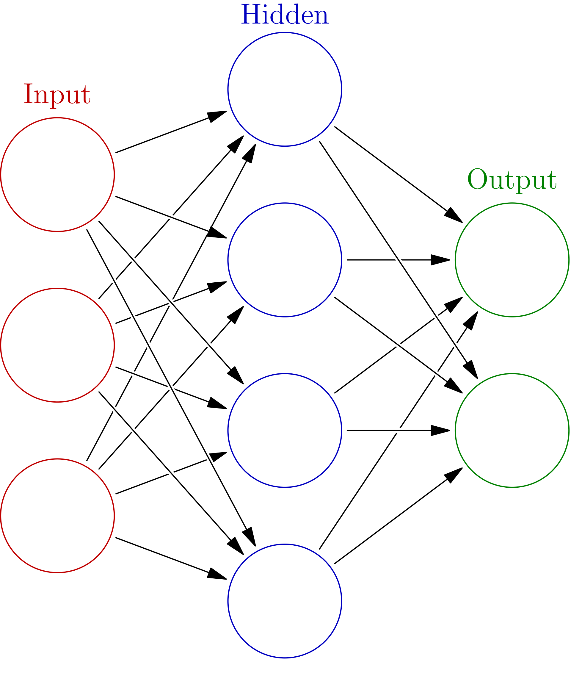

import MultipleChoiceQuiz from '../../components/MultipleChoiceQuiz.astro';
import FillInQuiz from '../../components/FillInQuiz.astro';

## Från en neuron till ett nätverk

En enskild neuron är bra på att fatta enkla, linjära beslut. Men verkligheten är sällan så enkel. Hur känner en AI igen din mormor på ett foto?

En neuron kan kanske lära sig att känna igen en vertikal linje i en bild. En annan kan lära sig känna igen en horisontell linje. Var för sig är de ganska begränsade.

Men om vi **kopplar ihop många neuroner i lager** kan vi skapa ett neuronnät som kan lära sig otroligt komplexa mönster!

---

## Perceptron: Alla neuronnäts moder

**Perceptron** är helt enkelt ett tjusigt namn på en enkel neuron vars aktiveringsfunktion är en stegfunktion. Detta var en av de första modellerna som tillämpades för neurala beräkningar, och eftersom den har en så central roll i neuronnätets historia, kan den med goda skäl kallas för **alla artificiella neuronnäts moder**.

### Frank Rosenblatt och perceptronalgoritmen

År 1957 presenterade psykologen **Frank Rosenblatt** perceptronalgoritmen - en metod för att lära perceptronen rätt vikter från data. Principen är enkel:

1. Mata in ett träningsexempel i neuronen
2. Kontrollera om klassificeringen är rätt
3. Om den är fel, justera vikterna
4. Upprepa tills neuronen klassificerar rätt

Perceptroner kan användas som enkla klassificerare med två olika klasser - till exempel "katt eller hund", "spam eller inte spam", "godkänd eller underkänd".

<MultipleChoiceQuiz 
  question="Vad är en perceptron?"
  options={[
    "En neuron med sigmoidfunktion",
    "En neuron med stegfunktion",
    "Ett helt neuronnät",
    "En träningsalgoritm"
  ]}
  correctAnswer={1}
  explanation="En perceptron är en neuron som använder en stegfunktion som aktiveringsfunktion. Den kan bara ge två olika utdata: 0 eller 1."
/>

### AI-hypen på 1960-talet

Perceptronalgoritmen fick **väldigt mycket uppmärksamhet** direkt efter att den utvecklades. Frank Rosenblatt spelade en viktig roll för det uppvaknande intresset. 

Ett klassiskt exempel på AI-hypen är en artikel publicerad i **New York Times den 8 juni 1958**:

> "USA:s flotta har i dag visat ett embryo till en elektronisk dator och den förväntas kunna gå, tala, se och föröka sig själv och dessutom bli medveten om sin egen existens."

Låter det bekant? Samma typ av överdrivna förväntningar ser vi även idag när nya AI-genombrott presenteras!

> [!WARNING] AI-vintern
> Både neuronnätsentusiasmen på 60-talet och entusiasmen kring expertsystem på 80-talet fick ett snöpligt slut när inga genombrott kom och finansieringen för forskning rasade – följden blev så kallade **AI-vintrar**.
> 
> Debatten kring neuronnät ledde till att man under två årtionden nästan helt övergav tekniken. Först på 2000-talet, med mer data och bättre datorer, kom neuronnäten tillbaka.

<MultipleChoiceQuiz 
  question="Vad är en 'AI-vinter'?"
  options={[
    "När AI-system inte fungerar i kallt väder",
    "En period då intresset och finansieringen för AI-forskning minskar drastiskt",
    "När neuronnät tränas på vinterbilder",
    "En ny typ av aktiveringsfunktion"
  ]}
  correctAnswer={1}
  explanation="En AI-vinter är en period då överdrivna förväntningar inte infrias, vilket leder till minskad finansiering och intresse för AI-forskning. Detta hände både på 1970-talet och 1980-talet."
/>

---

## Neuronnätets arkitektur

Arkitekturen, dvs. strukturen i neuronnätet, är oftast ordnad så att neuronerna har delats in i flera **lager**:

**Indatalagret** 
- Omfattar de neuroner som får sina indata utifrån
- Till exempel pixlar i en bild som visas för nätet
- Detta är neuronnätets indata

**Dolda lager**
- Ett eller flera lager mellan indata och utdata
- Får sina indata från andra neuroner
- Ger sina utdata till andra neuroner
- Här sker den "magiska" bearbetningen

**Utdatalagret**
- Producerar utdata från hela nätet
- Till exempel "katt" eller "hund" i en klassificerare

*Illustration av ett neuronnät med indatalager (grönt), dolda lager (blått) och utdatalager (rött). Varje cirkel är en neuron och linjerna visar kopplingar mellan neuroner.*

### Hierarkisk inlärning

Genom att koppla ihop neuroner i lager kan ett neuronnät lära sig komplexa mönster hierarkiskt:

**1. Första lagret (enkla mönster)**
- Känner igen grundläggande saker: kanter, hörn, färgfläckar

**2. Mellanliggande lager (kombinationer)**
- Kombinerar enkla mönster till mer komplexa
- Exempel: kanter → former → delar av objekt

**3. Sista lagren (komplexa strukturer)**
- Känner igen hela objekt: ansikten, djur, föremål

<MultipleChoiceQuiz 
  question="Vad känner neuroner i det första lagret igen i ett bildigenkänningsnätverk?"
  options={[
    "Hela ansikten",
    "Näsor och ögon",
    "Enkla kanter och hörn",
    "Komplexa objekt"
  ]}
  correctAnswer={2}
  explanation="Första lagret känner igen de enklaste byggstenarna: kanter, hörn och färgfläckar. Senare lager kombinerar dessa till mer komplexa mönster!"
/>

> [!NOTE] Djupinlärning
> **Djupinlärning** syftar på denna lagerstruktur: ju fler lager, desto djupare nät. 
> 
> Djupet gör det svårare för nätet att lära sig och det förutsätter både större mängder data och större beräkningskapacitet. Om dessa förutsättningar finns ger de dock möjligheten för nätet att lära sig mer komplexa fenomen.

<FillInQuiz 
  question="Om ett neuronnät har 1 indatalager, 5 dolda lager och 1 utdatalager, hur många lager har nätet totalt?"
  correctAnswer={["7", "7 lager", "sju"]}
  type="text"
  explanation="Totalt 7 lager: 1 indatalager + 5 dolda lager + 1 utdatalager = 7 lager. Ju fler dolda lager, desto 'djupare' är nätet!"
/>

### Flerlagersperceptron

Ett klassiskt exempel på ett flerlagers neuronnät är en så kallad **flerlagersperceptron** (eng. multilayer perceptron, MLP). 

Den tidigare nämnda perceptronalgoritmen som Rosenblatt utarbetat lämpar sig för att justera vikterna på en enskild neuron. I flerlagersperceptroner är justeringen av vikter en utmaning av ett helt annat slag och att hitta en fungerande lösning tog väldigt länge.

### Backpropagation: Genombrottet

Till slut hittade man ändå en lösning: den så kallade **backpropagation-algoritmen** bidrog till att neuronnäten återuppstod i slutet av 80-talet. Den utgör fortfarande kärnan för många metoder inom djupinlärning.

Backpropagation fungerar genom att:
1. Mata in data genom nätet (framåt)
2. Jämföra utdata med rätt svar
3. Beräkna felet
4. **Skicka felet bakåt** genom nätet
5. Justera vikterna i varje lager baserat på hur mycket de bidrog till felet

> [!INFO] Under tiden i Helsingfors…
> Vägen som ledde till backpropagation är lång och krokig. Ett fascinerande spår går via Institutionen för datavetenskap vid Helsingfors universitet. 
> 
> År 1967 – ca tre år efter att institutionen hade grundats – skrev studenten **Seppo Linnainmaa** en magistersavhandling med rubriken "Kumulativa avrundningsfel i en algoritm som en Taylor-approximation av individuella avrundningsfel".
> 
> Den metod för automatisk derivering som utarbetades i avhandlingen kunde senare användas av andra forskare för att beräkna känsligheten i utdata i flerlagers neuronnät med hänsyn till deras individuella vikter, vilket är den centrala idén med backpropagation.

<MultipleChoiceQuiz 
  question="Vad gör backpropagation-algoritmen?"
  options={[
    "Skickar data framåt genom nätet",
    "Skickar fel bakåt genom nätet för att justera vikter",
    "Tar bort neuroner från nätet",
    "Lägger till fler lager automatiskt"
  ]}
  correctAnswer={1}
  explanation="Backpropagation skickar felet bakåt (därav namnet!) genom nätet och justerar vikterna i varje lager baserat på hur mycket de bidrog till felet. Detta är grunden för hur moderna neuronnät tränas."
/>

---

## Sammanfattning

> [!TIP] Nyckelkoncept
> - **Perceptron** = En neuron med stegfunktion, utvecklad av Frank Rosenblatt 1957
> - **AI-vintrar** = Perioder då överdrivna förväntningar ledde till minskad finansiering
> - **Neuronnät** = Många neuroner kopplade i lager (indata, dolda, utdata)
> - **Djupinlärning** = Neuronnät med många dolda lager
> - **Backpropagation** = Algoritm som tränar neuronnät genom att skicka fel bakåt

Du har nu lärt dig historien bakom neuronnät och hur man bygger dem genom att koppla ihop neuroner i lager!

---

**Nästa steg:** I nästa lektion ska vi se hur man kan använda enkla neuronnät för att klassificera bilder, och du får prova på att träna din egen klassificerare!
